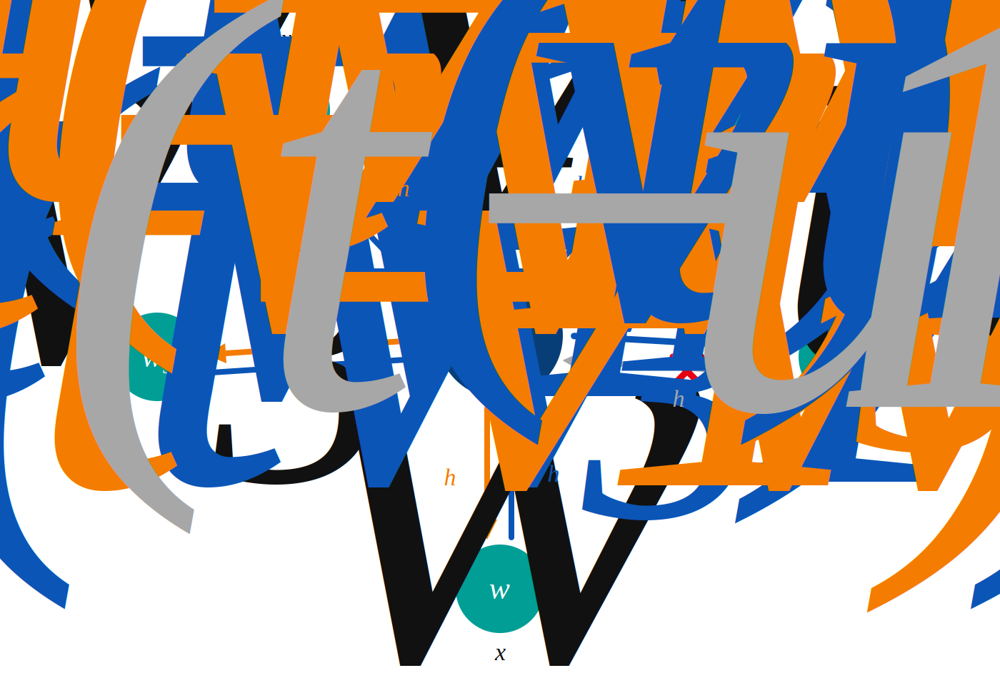
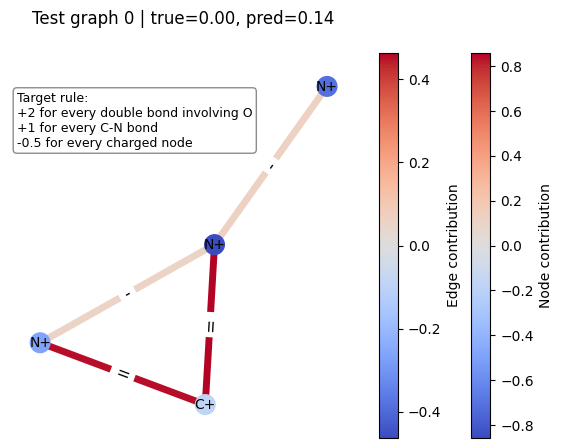

# Simple D-MPNN: A Minimal Directed Message Passing Neural Network in PyTorch

This repository provides a straightforward PyTorch implementation of the Directed Message Passing Neural Network (D-MPNN) introduced by [Yang et al. (2019)](https://arxiv.org/abs/1904.01561). The goal is to make directed, non-backtracking message passing easy to understand, inspect, and adapt outside the full Chemprop ecosystem.

This project is intended as an educational and lightweight implementation. It is not a drop-in replacement for Chemprop and does not include Chemprop's full molecular featurization, hyperparameter optimization, ensembling, checkpointing, or production training pipeline. For OGB molecular datasets, the package includes a small adaptation layer around OGB's atom and bond encoders so their categorical molecular features can be embedded in the intended way before entering the D-MPNN.

<p align="center">
  
  
</p>

<p align="center">
  <em>Left: schematic of non-backtracking directed message passing in a D-MPNN. Right: attribution plot from this repository's synthetic example.</em>
</p>

## D-MPNN Message Passing

For a directed bond $v \to u$, the initial hidden state is

```math
\mathbf{h}_{vu}^{(0)}
=
\sigma\!\left(\mathbf{W}_i[\mathbf{x}_v \,\|\, \mathbf{b}_{vu}]\right).
```

The non-backtracking message excludes the immediate reverse edge $u \to v$:

```math
\mathbf{m}_{vu}^{(t+1)}
=
\sum_{k \in \mathcal{N}(v)\setminus\{u\}}
\mathbf{h}_{kv}^{(t)}.
```

The hidden state update is

```math
\mathbf{h}_{vu}^{(t+1)}
=
\sigma\!\left(
\mathbf{h}_{vu}^{(0)}
+
\mathbf{W}_h\mathbf{m}_{vu}^{(t+1)}
\right),
```

and the final node-level representation is

```math
\mathbf{h}_u
=
\sigma\!\left(
\mathbf{W}_a
\left[
\mathbf{x}_u
\,\|\,
\sum_{v \in \mathcal{N}(u)}
\mathbf{h}_{vu}^{(T)}
\right]
\right).
```

## Repository Outline

```text
pyproject.toml
requirements.txt
README.md

dmpnn/
├── __init__.py
├── model.py
├── training.py
├── graph_utils.py
└── adapters.py

examples/
├── __init__.py
├── synthetic_graph_gen.py
├── demo_train_script.py
├── demo_inference_script.py
└── demo_imdb_binary.py

notebooks/
├── implementation_walkthrough.ipynb
│   └── Highly annotated walkthrough of the D-MPNN formulation and implementation
├── testing.ipynb
│   └── Tests using PyG graph objects, MoleculeNet datasets, OGB molecular datasets, plus minimal benchmarking against GINEConv
└── profile_dmpnn_training.ipynb
    └── CPU/GPU profiling notebook using PyTorch Profiler to inspect training-loop overhead and syncs
```

## Requirements

The core package requires PyTorch. The examples and notebooks additionally use PyTorch Geometric and related utilities listed in `requirements.txt`.

## Installation

To install the reusable D-MPNN package locally, run this from the root of the repository:

```bash
pip install -e .
```

To install the dependencies used by the examples and notebooks, run:

```bash
pip install -r requirements.txt
```

For CUDA machines, install the PyTorch build that matches your driver and hardware before installing the remaining dependencies. See the official PyTorch installation selector for the correct command.

## Usage

The reusable implementation is contained in `dmpnn/`.

After installation, you can import the main API directly:

```python
from dmpnn import DMPNN, DMPNNTrainer, OGBDMPNN
```

To use this project from another local repository, install it into that repository's environment with:

```bash
pip install -e /absolute/path/to/simple-dmpnn
```

## Installing from GitHub
To install the package directly from GitHub:

```bash
pip install git+https://github.com/michaelmontemurri/simple-dmpnn.git
```

## Demos

Run example scripts from the repository root using module syntax:

```bash
python -m examples.demo_train_script
python -m examples.demo_inference_script
python -m examples.demo_imdb_binary
```

For examples, see:

- [`examples/demo_train_script.py`](examples/demo_train_script.py) for training a D-MPNN on simulated graphs
- [`examples/demo_inference_script.py`](examples/demo_inference_script.py) for running inference with a trained model
- [`examples/demo_imdb_binary.py`](examples/demo_imdb_binary.py) for converting a non-molecular PyG dataset into the D-MPNN graph format and training a graph classifier
- [`notebooks/implementation_walkthrough.ipynb`](notebooks/implementation_walkthrough.ipynb) for an annotated explanation of the architecture
- [`notebooks/testing.ipynb`](notebooks/testing.ipynb) for testing with PyG graph objects, comparing against `GINEConv`, and training on an OGB molecular dataset with the OGB atom/bond encoder adaptation
- [`notebooks/profile_dmpnn_training.ipynb`](notebooks/profile_dmpnn_training.ipynb) for profiling CPU/GPU training-loop behavior with PyTorch Profiler

## Applying to a New Graph Dataset

To use the model on a new graph dataset, each graph should be represented with:

```python
graph = {
    "X": X,                  # node features, shape [num_nodes, node_feat_dim]
    "B": B,                  # directed edge features, shape [num_directed_edges, edge_feat_dim]
    "edge_index": edge_index,# directed edges, shape [2, num_directed_edges]
    "y": y,                  # graph-level target
}
```

The batching utilities construct the reverse-edge index, rev_index, needed for non-backtracking directed message passing. For PyTorch Geometric datasets, use the adapter utilities in dmpnn/adapters.py.

See examples/demo_imdb_binary.py for a complete non-molecular graph classification example using IMDB-BINARY.

### OGB Molecular Datasets

OGB molecular datasets such as `ogbg-molhiv` store atom and bond features as categorical integer columns rather than dense vectors. The `OGBMolecularEncoder` and `OGBDMPNN` helpers adapt those raw OGB features by applying OGB's learnable `AtomEncoder` and `BondEncoder` before the base D-MPNN sees them.

For an example that loads an OGB molecular dataset, wraps a `DMPNN` in `OGBDMPNN`, and trains/evaluates it, see the final section of [`notebooks/testing.ipynb`](notebooks/testing.ipynb).

## Features

- Directed edge hidden states with non-backtracking message passing
- Batched graph processing with directed edge indices and reverse-edge lookup
- Graph-level sum pooling and MLP prediction head
- Minimal trainer for regression and classification tasks
- PyG adapter utilities for using PyG graph objects
- OGB molecular encoder adaptation via `OGBMolecularEncoder` / `OGBDMPNN`
- Demo training and inference scripts
- Testing notebook with comparison to `GINEConv` and an OGB molecular training example
- Profiling notebook using PyTorch Profiler for CPU/GPU training-loop analysis

## Limitations

This implementation assumes simple bidirected graphs, with at most one directed edge for each ordered node pair. Multigraphs and duplicate parallel edges are not currently supported.


## Citation

This implementation is based on the Directed Message Passing Neural Network architecture introduced in:

Yang, K., Swanson, K., Jin, W., Coley, C., Eiden, P., Gao, H., Guzman-Perez, A., Hopper, T., Kelley, B., Mathea, M., Palmer, A., Settels, V., Jaakkola, T., Jensen, K., and Barzilay, R.  
“Analyzing Learned Molecular Representations for Property Prediction.”  
*Journal of Chemical Information and Modeling* 59, no. 8 (2019): 3370–3388.
