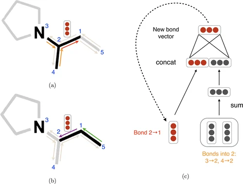

# Simple D-MPNN: Implementing the Directed Message Passing Neural Network From Scratch

This repository provides a straightforward PyTorch implementation of the Directed Message Passing Neural Network (D-MPNN) introduced by [Yang et al. (2019)](https://arxiv.org/abs/1904.01561). The goal is to make the architecture easy to understand, inspect, and adapt outside the full Chemprop ecosystem.


<p align="center">
  
  
</p>

<p align="center">
  <em>Left: D-MPNN schematic from Yang et al. (2019). Right: attribution plot from this repository's synthetic example.</em>
</p>


## Repository Outline

```text
dmpnn/
├── __init__.py
├── model.py
├── training.py
├── graph_utils.py
└── adapters.py

examples/
├── __init__.py
├── synthetic_graph_gen.py
├── demo_train_script.py
├── demo_inference_script.py
└── demo_imdb_binary.py

notebooks/
├── demo.ipynb
│   └── Annotated walkthrough of the D-MPNN theory and implementation
├── testing.ipynb
│   └── Tests using PyG graph objects, plus minimal benchmarking against GINEConv
└── profiling.ipynb
    └── CPU/GPU profiling notebook using PyTorch Profiler to inspect training-loop overhead and syncs
```

## Requirements

The notebooks and scripts are designed to run on:

- Apple Silicon with MPS
- CPU
- NVIDIA GPU with CUDA

For CUDA machines, install the PyTorch build that matches your driver and hardware before installing the remaining dependencies. See the official PyTorch installation selector for the correct command.

Install dependencies with:

```bash
pip install -r requirements.txt
```

## How to Use

The reusable implementation is contained in `dmpnn/`.

Run example scripts from the repository root using module syntax:

```bash
python -m examples.demo_train_script
python -m examples.demo_inference_script
python -m examples.demo_imdb_binary
```

For examples, see:

- examples/demo_train_script.py for training a D-MPNN on simulated graphs
- examples/demo_inference_script.py for running inference with a trained model
- examples/demo_imdb_binary.py for converting a non-molecular PyG dataset into the D-MPNN graph format and training a graph classifier
- notebooks/demo.ipynb for an annotated explanation of the architecture
- notebooks/testing.ipynb for testing with PyG graph objects and comparison to GINEConv
- notebooks/profiling.ipynb for profiling CPU/GPU training-loop behavior with PyTorch Profiler

## Applying to a New Graph Dataset

To use the model on a new graph dataset, each graph should be represented with:

```python
graph = {
    "X": X,                  # node features, shape [num_nodes, node_feat_dim]
    "B": B,                  # directed edge features, shape [num_directed_edges, edge_feat_dim]
    "edge_index": edge_index,# directed edges, shape [2, num_directed_edges]
    "rev_index": rev_index,  # reverse-edge index for each directed edge
    "y": y,                  # graph-level target
}
```

The batching utilities construct the reverse-edge index, rev_index, needed for non-backtracking directed message passing. For PyTorch Geometric datasets, use the adapter utilities in dmpnn/adapters.py.

See examples/demo_train_imdb_binary.py for a complete non-molecular graph classification example using IMDB-BINARY.

## Features

- Directed edge hidden states with non-backtracking message passing
- Batched graph processing with directed edge indices and reverse-edge lookup
- Graph-level sum pooling and MLP prediction head
- Minimal trainer for regression and classification tasks
- PyG adapter utilities for using PyG graph objects
- Demo training and inference scripts
- Testing notebook with comparison to `GINEConv`
- Profiling notebook using PyTorch Profiler for CPU/GPU training-loop analysis

## Citation

This implementation is based on the Directed Message Passing Neural Network architecture introduced in:

Yang, K., Swanson, K., Jin, W., Coley, C., Eiden, P., Gao, H., Guzman-Perez, A., Hopper, T., Kelley, B., Mathea, M., Palmer, A., Settels, V., Jaakkola, T., Jensen, K., and Barzilay, R.  
“Analyzing Learned Molecular Representations for Property Prediction.”  
*Journal of Chemical Information and Modeling* 59, no. 8 (2019): 3370–3388.
